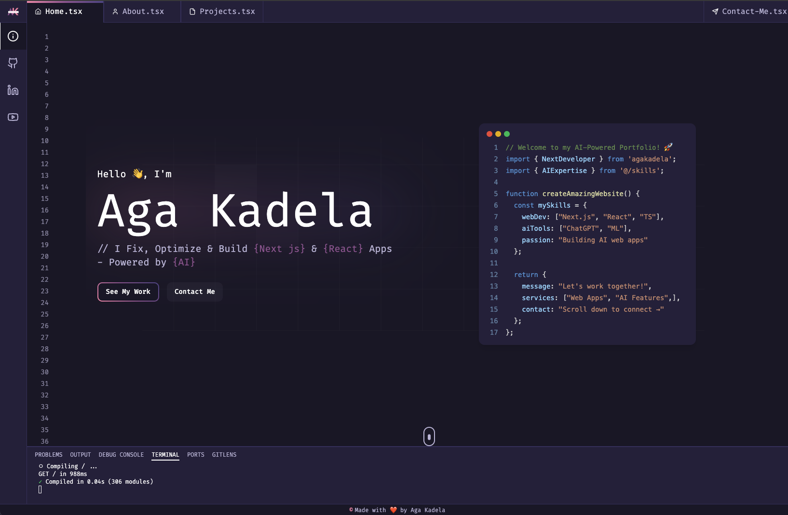

# AI-Powered Portfolio Website

A modern, interactive portfolio website built with Next.js, React, and TypeScript, featuring AI-powered components and smooth animations. The site includes an intelligent chat assistant powered by Google's Gemini AI model.



## Features

- 🤖 **AI Chat Assistant** - Interactive chat powered by Google Gemini
- 🚀 **Interactive Code Typing Animation** - Dynamic code display with syntax highlighting
- 💻 **Responsive Design** - Optimized for all devices from mobile to desktop
- 🎨 **Modern UI/UX** - Clean, professional interface with smooth animations
- 🌙 **Dark Mode** - Sleek dark theme for optimal viewing
- 📧 **Contact Form** - Integrated with Resend for reliable email delivery
- 📱 **Mobile-First Approach** - Fully responsive with tailored mobile experience
- 🎯 **SEO Optimized** - Built-in metadata configuration
- ⚡ **Performance Optimized** - Fast loading and smooth transitions
- 🔄 **Loading Animations** - Smooth loading transitions with Lottie

## Tech Stack

- **Framework**: Next.js
- **Language**: TypeScript
- **Styling**: Tailwind CSS with CSS Variables
- **Animations**:
  - Framer Motion
  - Lottie Animations
- **Form Handling**: React Hook Form with Zod validation
- **UI Components**:
  - shadcn/ui
  - Lucide React Icons
- **Email Service**: Resend
- **AI Integration**: Google Gemini AI
- **Code Highlighting**: Prism React Renderer
- **UI Components**: Custom components with shadcn/ui
- **AI Model**: Google Gemini
- **Deployment**: [Your deployment platform]

## Development Requirements

- Node.js 18+
- npm or yarn or pnpm
- Git

## Getting Started

1. **Clone the repository**

   ```bash
   git clone https://github.com/agakadela/my-website.git
   cd ai-portfolio
   ```

2. **Install dependencies**

   ```bash
   npm install
   # or
   yarn install
   # or
   pnpm install
   ```

3. **Set up environment variables**

   ```bash
   # Create a .env.local file with the following variables:
   RESEND_API_KEY=your_resend_api_key
   GOOGLE_API_KEY=your_gemini_api_key
   ```

4. **Start the development server**

   ```bash
   npm run dev
   # or
   yarn dev
   ```

5. **Build for production**
   ```bash
   npm run build
   # or
   yarn build
   ```

## Customizing the Portfolio

All the main content of the portfolio is centralized in the `data/index.ts` file for easy customization. Here's how to modify each section:

### 1. Personal Information

Update the home section with your details:

```typescript
home: {
  name: "Your Name",
  description: "Your Tagline", // Use # for styling, _ for space, __ for dash
  cvLink: "#contact", // Or link to your CV
}
```

### 2. Social Links

Modify the sidebar links with your social media profiles:

```typescript
sidebar: {
  links: [
    {
      name: "github",
      link: "https://github.com/yourusername",
      icon: Github,
    },
    // Add or remove social links as needed
  ];
}
```

### 3. Projects

Showcase your projects by updating the projects array:

```typescript
projects: {
  projects: [
    {
      id: 1,
      title: "Project Name",
      description:
        "Project description.\n\n Technologies Used: Tech1, Tech2, Tech3",
      image: "/projects-imgs/your-image.png", // Add image to public/projects-imgs/
      previewLink: "https://project-url.com",
    },
    // Add more projects
  ];
}
```

### 4. Technologies/Skills

Customize your skills section:

```typescript
technologies: {
  skills: [
    {
      id: 1,
      name: "technology-name",
      src: "/skills/icon.svg", // Add icon to public/skills/
      link: "https://link-to-technology-info",
    },
    // Add more skills
  ];
}
```

### 5. Contact Information

Update your contact details:

```typescript
contact: {
  email: "your.email@domain.com",
  name: "Your Name"
}
```

### Image Requirements

- Project images: Add to `public/projects-imgs/` (Recommended size: 1200x630px)
- Skill icons: Add to `public/skills/` (SVG format recommended)
- All images should be optimized for web use

### Styling Notes

- Use `#` before words in descriptions for special styling
- Use `_` for spaces in specially styled text
- Use `__` for dashes in specially styled text
- The portfolio uses Tailwind CSS for styling - customize colors in `tailwind.config.ts`

### Environment Variables

After customizing, make sure to set up your environment variables in `.env.local`:

```bash
RESEND_API_KEY=your_resend_api_key # Get from https://resend.com
GOOGLE_API_KEY=your_gemini_api_key # Get from Google Cloud Console
```

### AI Assistant Customization

The AI chat assistant's responses are based on your data file content. Update the information in `data/index.ts` to ensure the AI provides accurate information about you and your work.

## Project Structure

- `app/` - Next.js app directory and API routes
  - `(main)/` - Main application routes
  - `api/` - API endpoints for email and chat
- `components/` - React components
  - `layout/` - Layout components (header, footer, etc.)
  - `sections/` - Page sections (home, about, projects, etc.)
  - `ui/` - Reusable UI components from shadcn/ui
- `data/` - Static data and content configuration
- `hooks/` - Custom React hooks
- `lib/` - Utility functions and shared code
- `public/` - Static assets

  - `imgs/` - Image assets
  - `skills/` - Skill icons
  - `projects-imgs/` - Project screenshots
  - `lottie/` - Lottie animation files

  ## Deployment

This portfolio is optimized for deployment on Vercel. To deploy:

1. Fork this repository
2. Create a new project on Vercel
3. Connect your forked repository
4. Add the required environment variables:
   - `RESEND_API_KEY`
   - `GEMINI_API_KEY`
5. Deploy!

## Environment Variables

The following environment variables are required:

- `RESEND_API_KEY` - API key for email service
- `GOOGLE_API_KEY` - API key for Gemini Pro AI (required for chat assistant)

## Contact

Aga Kadela

- Website: [agakadela.com](https://agakadela.com)
- Email: aga.kadela.dev@gmail.com
- GitHub: [@agakadela](https://github.com/agakadela)

## License

This project is licensed under the MIT License - see the [LICENSE](LICENSE) file for details.

## Acknowledgments

- [Next.js](https://nextjs.org)
- [Tailwind CSS](https://tailwindcss.com)
- [Framer Motion](https://www.framer.com/motion)
- [shadcn/ui](https://ui.shadcn.com)
- [Google Gemini](https://deepmind.google/technologies/gemini/)
- [Resend](https://resend.com)

---

Made with ❤️ by Aga Kadela
